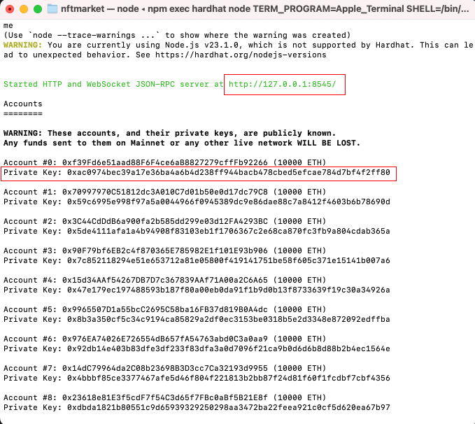
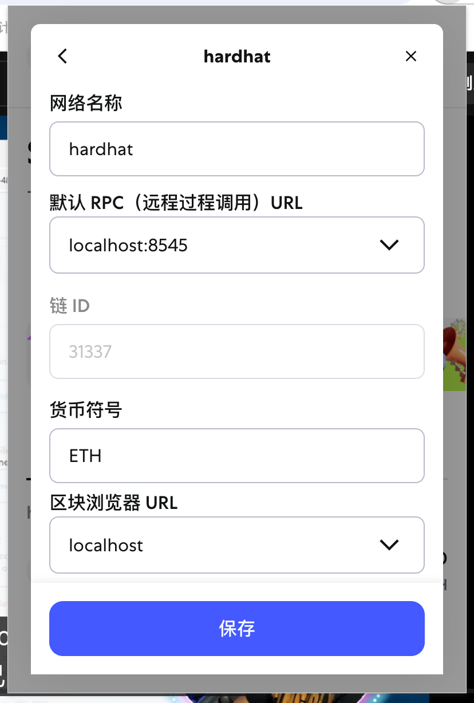
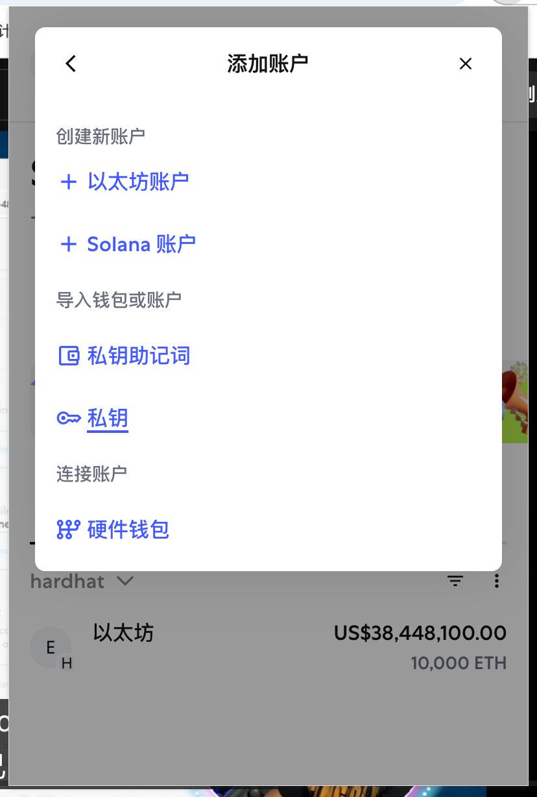
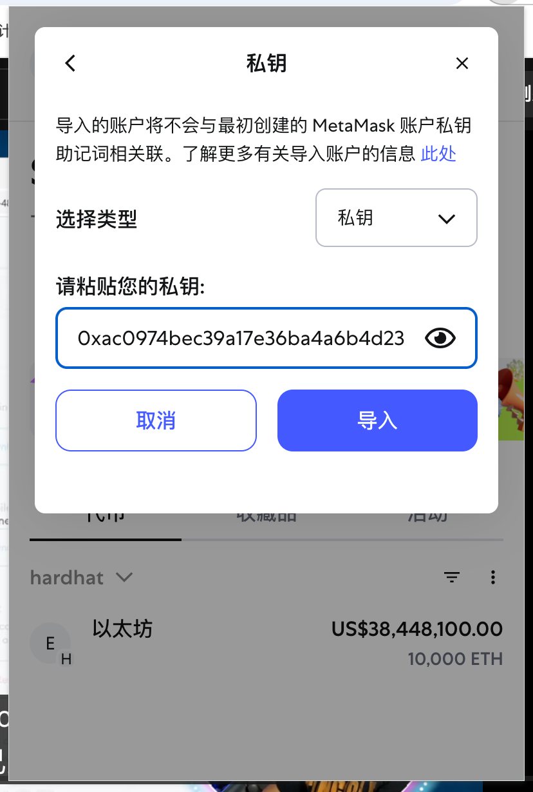
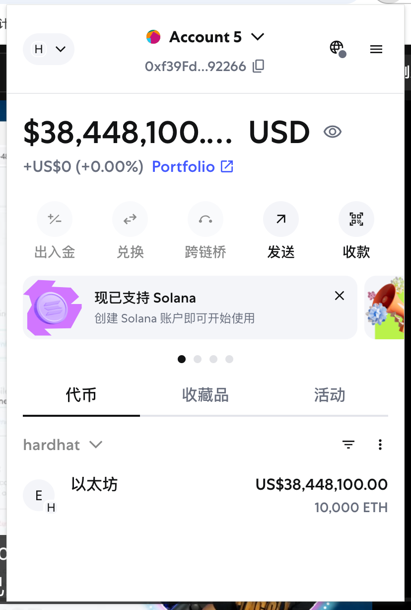
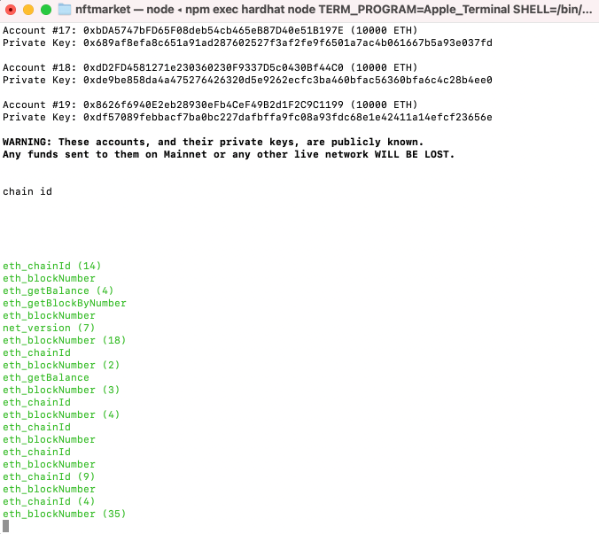
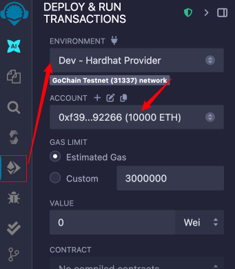

# 构建强大的 Next.js Web3 多链 NFT 交易平台

## 1. 搭建 Next.js 项目

1. 在终端运行以下命令创建项目（以 Next.js 14.x 为例）：

  ```bash
  npx create-next-app@14 nftMarket
  ```

  > **说明**：`npx` 是一个用于临时运行 npm 包的工具。与 `npm` 不同，`npx` 在执行完命令后会自动清理临时安装的包，但不会删除项目中的 `node_modules` 文件夹。`node_modules` 只会在你手动删除或运行特定命令时被移除。  
  > 本项目推荐使用 **Next.js 14.x** 版本。

2. 安装 Hardhat（以太坊开发环境，推荐使用 Hardhat 2.22.x）：

  ```bash
  npm install hardhat@2.22
  ```

  > **说明**：Hardhat 可以帮助我在本地搭建以太坊开发环境，避免直接连接到公共或私人 RPC 节点。通过配置 Hardhat 网络，我可以连接不同的区块链节点（如本地节点、测试网或主网），具体方式是在 `hardhat.config.js` 文件中设置 `networks` 属性。  
  > 本项目推荐使用 **Hardhat 2.22.x** 版本。

## 2. 启动 Hardhat、本地节点与连接钱包

1. 运行以下命令初始化 Hardhat 项目：

  ```bash
  npx hardhat init
  ```

  > **说明**：执行该命令后，会进入 Hardhat 的项目初始化向导，可以选择创建一个基础样板项目。初始化完成后，项目目录下会包含示例合约、测试脚本和配置文件，为后续的智能合约开发与测试提供完整的本地开发环境。更多可点击查看 [Hardhat 官方文档](https://hardhat.org/getting-started/)

2. 查看本地测试钱包

  在 Hardhat 的新版本中，`npx hardhat accounts` 命令已被移除。现在可以通过以下命令启动本地节点，并查看自动生成的测试账户和私钥：

  ```bash
  npx hardhat node
  ```

  启动后，终端会输出一组测试账户及其私钥，每个账户都预置了大量测试用 ETH，方便开发和测试使用。

  
  我可以看到 Hardhat 为我启动了一个本地的 RPC 节点，并生成了多个拥有巨额以太币的测试钱包。

3. 连接钱包（以 MetaMask 为例）

  - 在浏览器中打开 MetaMask，点击网络选择器，添加自定义网络。将网络 RPC 地址设置为 `http://127.0.0.1:8545`，链 ID 设置为 `31337`（Hardhat 默认链 ID），保存后切换到该网络。
    
  - 选择“导入账户”，选择“使用私钥导入”，将刚才在终端中 Hardhat 输出的任意一个私钥粘贴进去，点击确认。
    
    
  - 导入成功后，我可以看到该账户拥有大量测试 ETH，说明连接成功。
    

  > 💡 小提示：当钱包连接到 Hardhat 提供的本地 RPC 节点后，所有与钱包相关的链上交互（如转账、部署合约等）都会实时显示在运行 `npx hardhat node` 的终端窗口中，方便调试和追踪。
  

## 3. 连接智能合约

我可以通过 Remix IDE 进行合约的部署和交互。打开 [Remix IDE](https://remix.ethereum.org/)，在“部署与运行交易”面板中，选择“Injected Provider - MetaMask”作为环境，确保已连接到刚才添加的本地 Hardhat 网络。选择要部署的合约，点击“Deploy”即可通过本地钱包与 Hardhat 节点进行交互。



---

## NFT 市场的核心需求与流程

### 1. 卖方流程

- 卖方需要有一个 NFT 列表，用于展示其待售的 NFT。每个列表项包含以下信息：
  - `itemId`：市场内的唯一标识
  - `tokenId`：NFT 合约中的唯一标识
  - `seller`：卖方的钱包地址
  - `price`：NFT 售价（可为原生代币或指定代币）
  - `owner`：当前拥有者（上架后为市场合约地址）

- 卖方操作流程：
  1. 我选择要出售的 NFT，点击“卖出”按钮。
  2. 触发链上交易，将 NFT 转移到市场合约地址。
  3. 市场合约记录该 NFT 的详细信息。

- 合约端需实现的功能：
  1. 检查 NFT 是否已在市场列表中（去重）。
  2. 填写并记录售价。
  3. 调用 NFT 合约，完成 tokenId 的转让。

### 2. 买方流程

1. 我可以浏览市场上的 NFT 列表（这些列表是通过调用合约的接口展示出来的）。
2. 选择心仪的 NFT，点击购买，调用合约的 transfer 方法，调起钱包，支付相应价格（通常资金会先存入市场合约，由合约托管，确保交易安全，之后再转给卖家）。
3. 合约会将 NFT 的所有权转给我（通过调用 NFT 合约的 `transferFrom` 方法，将 tokenId 的所有者地址修改为我的钱包地址）。

---

## 常见问题解答 🤔

**Q: NFT 列表的数据是怎么来的？**  
A: NFT 列表通常是通过调用市场合约的接口（如 `fetchMarketItems`）获取的，合约会返回所有在售 NFT 的详细信息。

**Q: 买家支付的 ETH 是直接给卖家吗？**  
A: 一般不是。买家支付的 ETH 会先存入市场合约，由合约托管，等交易完成后再转给卖家，这样可以防止欺诈。

**Q: NFT 的所有权是怎么转移的？**  
A: 合约会调用 NFT 合约的 `transferFrom` 方法，将 NFT 的所有者地址从市场合约地址修改为买家的钱包地址。

**Q: 如何保证 NFT 不会重复上架？**  
A: 合约会在上架前检查 NFT 是否已存在于市场列表中，防止重复上架。

---

> 🚀 通过以上流程，我可以快速搭建一个支持多链的 Web3 NFT 交易平台，体验完整的链上 NFT 交易流程！

nft collection smart contract address: 0x5FC8d32690cc91D4c39d9d3abcBD16989F875707
nft marketplace smart contract address: 0x0165878A594ca255338adfa4d48449f69242Eb8F