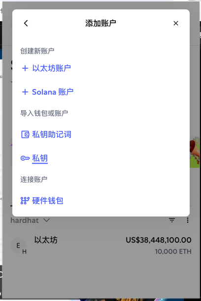
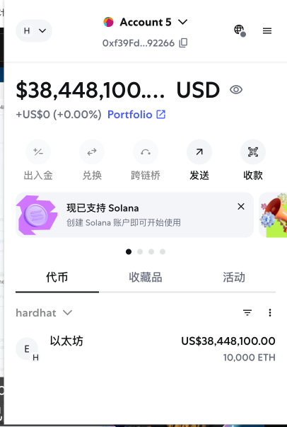

# 构建强大的 Next.js Web3 多链 NFT 交易平台

## 1. 搭建 Next.js 项目

1. 在终端运行以下命令创建项目（以 Next.js 14.x 为例）：

  ```bash
  npx create-next-app@14 nftMarket
  ```

  > **说明**：`npx` 是一个用于临时运行 npm 包的工具。与 `npm` 不同，`npx` 在执行完命令后会自动清理临时安装的包，但不会删除项目中的 `node_modules` 文件夹。`node_modules` 只会在你手动删除或运行特定命令时被移除。  
  > 本项目推荐使用 **Next.js 14.x** 版本。

2. 安装 Hardhat（以太坊开发环境，推荐使用 Hardhat 2.22.x）：

  ```bash
  npm install hardhat@2.22
  ```

  > **说明**：Hardhat 可以帮助你在本地搭建以太坊开发环境，避免直接连接到公共或私人 RPC 节点。你可以通过配置 Hardhat 网络来连接不同的区块链节点（如本地节点、测试网或主网），具体方式是在 `hardhat.config.js` 文件中设置 `networks` 属性。  
  > 本项目推荐使用 **Hardhat 2.22.x** 版本。

## 2. 启动 Hardhat、本地节点与连接钱包

1. 运行以下命令初始化 Hardhat 项目：

   ```bash
   npx hardhat init
   ```

   > **说明**：执行该命令后，会进入 Hardhat 的项目初始化向导，可以选择创建一个基础样板项目。初始化完成后，项目目录下会包含示例合约、测试脚本和配置文件，为后续的智能合约开发与测试提供完整的本地开发环境。更多可点击查看 [Hardhat 官方文档](https://hardhat.org/getting-started/)

2. 查看本地测试钱包

   在 Hardhat 的新版本中，`npx hardhat accounts` 命令已被移除。现在可以通过以下命令启动本地节点，并查看自动生成的测试账户和私钥：

   ```bash
   npx hardhat node
   ```

   启动后，终端会输出一组测试账户及其私钥，每个账户都预置了大量测试用 ETH，方便开发和测试使用。

   
   可以看到 Hardhat 为我们启动了一个本地的 RPC 节点，并生成了多个拥有巨额以太币的测试钱包。

3. 连接钱包（以 MetaMask 为例）

   - 在浏览器中打开 MetaMask，点击网络选择器，添加自定义网络。将网络 RPC 地址设置为 `http://127.0.0.1:8545`，链 ID 设置为 `31337`（Hardhat 默认链 ID），保存后切换到该网络。
     
   - 选择“导入账户”，选择“使用私钥导入”，将刚才在终端中 Hardhat 输出的任意一个私钥粘贴进去，点击确认。
     
     
   - 导入成功后，可以看到该账户拥有大量测试 ETH，说明连接成功。
     

   > 小提示：当钱包连接到 Hardhat 提供的本地 RPC 节点后，所有与钱包相关的链上交互（如转账、部署合约等）都会实时显示在运行 `npx hardhat node` 的终端窗口中，方便调试和追踪。
   

## 3. 连接智能合约

我们可以通过 Remix IDE 进行合约的部署和交互。打开 [Remix IDE](https://remix.ethereum.org/)，在“部署与运行交易”面板中，选择“Injected Provider - MetaMask”作为环境，确保已连接到刚才添加的本地 Hardhat 网络。选择要部署的合约，点击“Deploy”即可通过本地钱包与 Hardhat 节点进行交互。

