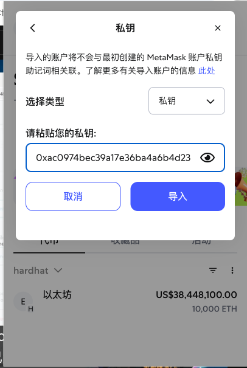

# 构建 Next.js Web3 多链 NFT 交易平台

## 1. 搭建 Next.js 项目

1. 在终端运行以下命令创建项目（以 Next.js 14.x 为例）：

```bash
npx create-next-app@14 nftMarket
```

> **说明**：`npx` 是一个用于临时运行 npm 包的工具。与 `npm` 不同，`npx` 在执行完命令后会自动清理临时安装的包，但不会删除项目中的 `node_modules` 文件夹。`node_modules` 只会在你手动删除或运行特定命令时被移除。  
> 本项目推荐使用 **Next.js 14.x** 版本。

2. 安装 Hardhat（以太坊开发环境，推荐使用 Hardhat 2.22.x）：

```bash
npm install hardhat@2.22
```

> **说明**：Hardhat 可以帮助我在本地搭建以太坊开发环境，避免直接连接到公共或私人 RPC 节点。通过配置 Hardhat 网络，我可以连接不同的区块链节点（如本地节点、测试网或主网），具体方式是在 `hardhat.config.js` 文件中设置 `networks` 属性。  
> 本项目推荐使用 **Hardhat 2.22.x** 版本。

## 2. 启动 Hardhat、本地节点与连接钱包

1. 运行以下命令初始化 Hardhat 项目：

```bash
npx hardhat init
```

> **说明**：执行该命令后，会进入 Hardhat 的项目初始化向导，可以选择创建一个基础样板项目。初始化完成后，项目目录下会包含示例合约、测试脚本和配置文件，为后续的智能合约开发与测试提供完整的本地开发环境。更多可点击查看 [Hardhat 官方文档](https://hardhat.org/getting-started/)

2. 查看本地测试钱包

在 Hardhat 的新版本中，`npx hardhat accounts` 命令已被移除。现在可以通过以下命令启动本地节点，并查看自动生成的测试账户和私钥：

```bash
npx hardhat node
```

启动后，终端会输出一组测试账户及其私钥，每个账户都预置了大量测试用 ETH，方便开发和测试使用。


我可以看到 Hardhat 为我启动了一个本地的 RPC 节点，并生成了多个拥有巨额以太币的测试钱包。

3. 连接钱包（以 MetaMask 为例）

- 在浏览器中打开 MetaMask，点击网络选择器，添加自定义网络。将网络 RPC 地址设置为 `http://127.0.0.1:8545`，链 ID 设置为 `31337`（Hardhat 默认链 ID），保存后切换到该网络。

  
- 选择“导入账户”，选择“使用私钥导入”，将刚才在终端中 Hardhat 输出的任意一个私钥粘贴进去，点击确认。

  
  
- 导入成功后，我可以看到该账户拥有大量测试 ETH，说明连接成功。

  

> 💡 小提示：当钱包连接到 Hardhat 提供的本地 RPC 节点后，所有与钱包相关的链上交互（如转账、部署合约等）都会实时显示在运行 `npx hardhat node` 的终端窗口中，方便调试和追踪。
> 

## 3. 连接智能合约

我可以通过 Remix IDE 进行合约的部署和交互。打开 [Remix IDE](https://remix.ethereum.org/)，在“部署与运行交易”面板中，选择“Injected Provider - MetaMask”作为环境，确保已连接到刚才添加的本地 Hardhat 网络。选择要部署的合约，点击“Deploy”即可通过本地钱包与 Hardhat 节点进行交互。


---

## NFT 市场的核心需求与流程

### 1. 卖方流程

- 卖方需要有一个 NFT 列表，用于展示其待售的 NFT。每个列表项包含以下信息：

  - `itemId`：市场内的唯一标识
  - `tokenId`：NFT 合约中的唯一标识
  - `seller`：卖方的钱包地址
  - `price`：NFT 售价（可为原生代币或指定代币）
  - `owner`：当前拥有者（上架后为市场合约地址）

- 卖方操作流程：

  1. 我选择要出售的 NFT，点击“卖出”按钮。
  2. 触发链上交易，将 NFT 转移到市场合约地址。
  3. 市场合约记录该 NFT 的详细信息。

- 合约端需实现的功能：
  1. 检查 NFT 是否已在市场列表中（去重）。
  2. 填写并记录售价。
  3. 调用 NFT 合约，完成 tokenId 的转让。

<!-- 占位符：请上传 NFT 卖家在前端选择 NFT 并上架的流程示意图或界面截图 -->

### 2. 买方流程

1. 我可以浏览市场上的 NFT 列表（这些列表是通过调用合约的接口展示出来的）。
2. 选择心仪的 NFT，点击购买，调用合约的 transfer 方法，调起钱包，支付相应价格（通常资金会先存入市场合约，由合约托管，确保交易安全，之后再转给卖家）。
3. 合约会将 NFT 的所有权转给我（通过调用 NFT 合约的 `transferFrom` 方法，将 tokenId 的所有者地址修改为我的钱包地址）。

<!-- 占位符：请上传 NFT 买家在前端浏览、购买 NFT 的流程示意图或界面截图 -->

---

## 实战演练：完整链上 NFT 流程笔记

> 下面是我基于本项目合约（`NFTCollection.sol` 和 `NFTMarketResell.sol`）的完整链上 NFT 流程实战笔记，包含每一步的操作说明和合约交互细节，帮助我快速理解和复现整个 NFT 交易闭环。

### 1. 本地环境准备与钱包说明

- 我默认已经搭建好 Hardhat 环境（见前文），并通过 `npx hardhat node` 启动了本地节点。
- 我需要准备三个钱包：一个用于部署合约，一个作为 NFT 卖家，一个作为 NFT 买家。可以直接用 Hardhat node 启动时自动生成的钱包，也可以用下方示例钱包（仅用于本地测试，**不要用于主网**）。

> ⚠️ **安全提示**：本地 Hardhat 节点生成的钱包私钥仅在本地有效，换到其他机器或网络无法直接使用。如果我用的是下方提供的钱包和私钥，也只能在本地 Hardhat 环境下使用。  
> **如需公开分享，请将私钥注释掉，不要删除。**

```text
// 部署 NFT 市场钱包（仅本地测试用）：
部署钱包地址：0xf39Fd6e51aad88F6F4ce6aB8827279cffFb92266
// 部署钱包私钥：0xac0974bec39a17e36ba4a6b4d238ff944bacb478cbed5efcae784d7bf4f2ff80

// NFT 卖家钱包：
卖家钱包地址：0x70997970C51812dc3A010C7d01b50e0d17dc79C8
// 卖家钱包私钥：0x59c6995e998f97a5a0044966f0945389dc9e86dae88c7a8412f4603b6b78690d

// NFT 买家钱包：
买家钱包地址：0x3C44CdDdB6a900fa2b585dd299e03d12FA4293BC
// 买家钱包私钥：0x5de4111afa1a4b94908f83103eb1f1706367c2e68ca870fc3fb9a804cdab365a
```

<!-- 占位符：请上传 MetaMask 导入本地测试钱包的截图 -->
<!-- 占位符：请上传 MetaMask 钱包切换到本地 Hardhat 网络的截图 -->

### 2. 部署 NFT 合约

- 我选择在 Remix IDE 中部署合约，确保已连接到本地 Hardhat 网络。
- 部署 `NFTCollection` 合约，记录合约地址（后续与市场合约交互需用到）。
- 部署 `NFTMarketResell` 合约，构造函数参数填写刚才记录的 `NFTCollection` 合约地址，记录市场合约地址。

```solidity
// 部署 NFTCollection 合约
Deploying contracts with the account: 0xf39fd6e51aad88f6f4ce6ab8827279cfffb92266
NFTCollection address: 0x1234567890abcdef1234567890abcdef12345678

// 部署 NFTMarketResell 合约
Deploying contracts with the account: 0xf39fd6e51aad88f6f4ce6ab8827279cfffb92266
NFTMarketResell address: 0xabcdefabcdefabcdefabcdefabcdefabcdefabcdef
```
<!-- 占位符：请上传 Remix 部署 NFTCollection 合约的截图 -->
<!-- 占位符：请上传 Remix 部署 NFTMarketResell 合约的截图 -->

### 3. 链上铸造 NFT

- 我通过调用市场合约的 `mint` 方法，传入 NFT 合约地址、代币 ID、售价等信息，在链上铸造 NFT。
- 铸造成功后，记录下新生成 NFT 的 `tokenId` 和 `itemId`。

```solidity
// 铸造 NFT
npx hardhat mint --contract 0xabcdefabcdefabcdefabcdefabcdefabcdefabcdef --tokenId 1 --price 2000000000000000000

// 输出示例
Minting NFT...
NFT minted: 
- tokenId: 1
- itemId: 1
- seller: 0x70997970C51812dc3A010C7d01b50e0d17dc79C8
- price: 2000000000000000000
- owner: 0xabcdefabcdefabcdefabcdefabcdefabcdefabcdef
```
<!-- 占位符：请上传 Remix 铸造 NFT 的操作界面截图 -->
<!-- 占位符：请上传 MetaMask 钱包中 NFT 显示的截图 -->

### 4. 上架 NFT

- 调用市场合约的 `listItem` 方法，将刚铸造的 NFT 上架出售。
- 上架时需提供 `tokenId`、售价等信息。

```solidity
// 上架 NFT
npx hardhat listItem --contract 0xabcdefabcdefabcdefabcdefabcdefabcdefabcdef --tokenId 1 --price 2000000000000000000

// 输出示例
Listing item...
Item listed: 
- itemId: 1
- tokenId: 1
- seller: 0x70997970C51812dc3A010C7d01b50e0d17dc79C8
- price: 2000000000000000000
- owner: 0xabcdefabcdefabcdefabcdefabcdefabcdefabcdef
```

### 5. 购买 NFT

- 作为买家，我调用市场合约的 `buyItem` 方法，传入 `itemId` 和支付的 ETH 数量，完成购买。
- 合约会自动处理代币的转移和价格的支付。

<!-- 占位符：请上传 Remix 购买 NFT 的操作界面截图 -->
<!-- 占位符：请上传 MetaMask 买家钱包收到 NFT 的截图 -->

### 6. 查看 NFT 详情

- 调用市场合约的 `getItem` 方法，传入 `itemId`，可以查询 NFT 的详细信息。
- 也可以通过 `getItemsBySeller` 方法，查询某个卖家的所有 NFT 列表。

<!-- 占位符：请上传 Remix 查询 NFT 详情的截图 -->

### 7. 取消上架

- 卖家可以调用市场合约的 `cancelListing` 方法，传入 `itemId`，将 NFT 从市场下架。
- 下架后，NFT 将返回给卖家钱包。

```solidity
// 取消上架
npx hardhat cancelListing --contract 0xabcdefabcdefabcdefabcdefabcdefabcdefabcdef --itemId 1

// 输出示例
Cancelling listing...
Listing cancelled: 
- itemId: 1
- tokenId: 1
- seller: 0x70997970C51812dc3A010C7d01b50e0d17dc79C8
```
<!-- 占位符：请上传 Remix 取消上架 NFT 的操作界面截图 -->

### 8. 合约交互细节

- 所有与合约的交互都通过 Hardhat 提供的本地节点进行，确保了安全性和私密性。
- 合约的每次调用和事件的触发，都会在 Hardhat 的终端中实时显示，方便我进行调试和验证。

```text
// 示例：购买 NFT 时的终端输出
npx hardhat buyItem --contract 0xabcdefabcdefabcdefabcdefabcdefabcdefabcdef --itemId 1 --value 2000000000000000000

// 输出示例
Buying item...
Item bought: 
- itemId: 1
- tokenId: 1
- seller: 0x70997970C51812dc3A010C7d01b50e0d17dc79C8
- buyer: 0x3C44CdDdB6a900fa2b585dd299e03d12FA4293BC
- price: 2000000000000000000

// 事件日志
Event: ItemBought
- itemId: 1
- tokenId: 1
- seller: 0x70997970C51812dc3A010C7d01b50e0d17dc79C8
- buyer: 0x3C44CdDdB6a900fa2b585dd299e03d12FA4293BC
- price: 2000000000000000000
```
<!-- 占位符：请上传 Hardhat 终端显示合约事件日志的截图 -->

### 9. 常见问题排查

- 如果遇到合约部署失败，首先检查 Hardhat 是否正常运行，确保本地节点已启动。
- 调用合约方法时，如果提示 `revert` 错误，通常是因为参数错误或合约状态不正确，仔细检查调用参数和合约逻辑。
- 通过 Hardhat 提供的终端输出，可以实时查看合约的状态变化和事件触发，帮助我快速定位问题。

```text
// 示例：revert 错误提示
Error: VM Exception while processing transaction: revert ERC721: transfer caller is not owner nor approved

// 解决方法：确保调用者是合约的拥有者或已被授权进行转移操作。
```
<!-- 占位符：请上传 Remix 或终端出现 revert 错误提示的截图 -->

### 10. 总结与反思

通过本次实战演练，我完整体验了一遍 NFT 从铸造、上架到交易的链上流程，加深了对合约交互和市场机制的理解。在实际操作中，Hardhat 提供的本地开发环境极大地方便了我的调试和测试，而 Remix IDE 则为合约的编写和部署提供了直观的界面。后续我将继续优化合约逻辑，并尝试在真实的测试网环境中进行部署和测试。